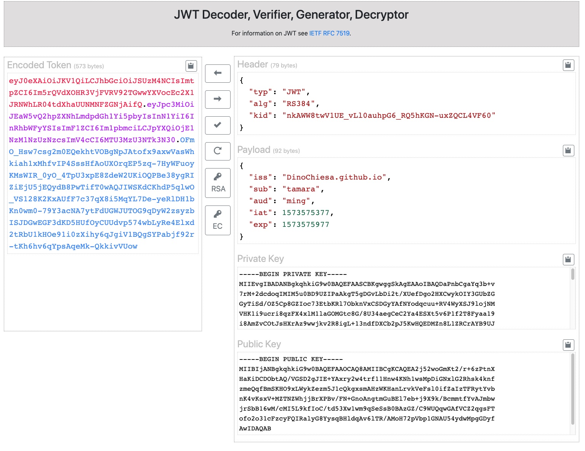

# JWT Web tool

This is the source code for a web tool that
can decode JWT, verify signed JWT, decrypt encrypted JWT, and create signed or
encrypted JWT.



## License

This code is Copyright (c) 2019 Google LLC, and is released under the Apache Source License v2.0. For information see the [LICENSE](LICENSE) file.

## Disclaimer

This tool is not an official Google product, nor is it part of an official Google product.

## Limitations

This tool is limited to handle:
 - signed JWT with ECDSA or RSA keys. No HMAC-signed JWT.
 - encrypted JWT that use RSA keys, and alg=RSA-OAEP-256. No other alg types for encrypted JWT.
   (All types of enc)

This tool uses EcmaScript v9, and webcrypto, which means it will run only on
modern, current browsers.


## Dependencies

The web app depends on
* [jQuery](https://jquery.com/) - for interactivity
* [Bootstrap 4.0](https://getbootstrap.com/) - for UI and styling
* [node-jose](https://github.com/cisco/node-jose) - for JWT
* [CodeMirror](https://codemirror.net/) - for the in-browser editors
* [webcrypto](https://developer.mozilla.org/en-US/docs/Web/API/Web_Crypto_API) - for generating RSA and ECDSA keys


## Build Dependencies

This tool uses [webpack v4](https://webpack.js.org/) for bundling the assets.


## Please send pull requests

This is my first webpack project, so if anyone has some constructive feedback on
my webpack config, how to improve or optimize it, please let me know.  PR's will be
appreciated.

For example, the JS bundle is about 1mb and the css bundle is 400kb.  Is there a
better way to optimize this?


## Developing

If you fork this repo to mess with the code, here's what I advise.

To build a "development" distribution:

```
npm run devbuild
```

During development, I prefer to use the webpack "watch" capability, which
rebuilds as I modify the source code. For that, open a Chrome browser tab to
file:///path/to/dist/index.html .  Then in a terminal,

```
npm run watch
```

The above command will run "forever", and will rebundle when any source file
changes. When you save a file, wait a few seconds for the build, maybe 5
seconds, and then just click the reload button in the browser tab, to see the
updates.


To build a production distribution:

```
npm run build
```

## Bugs

* Today, there is no support for HMAC-signed JWT
