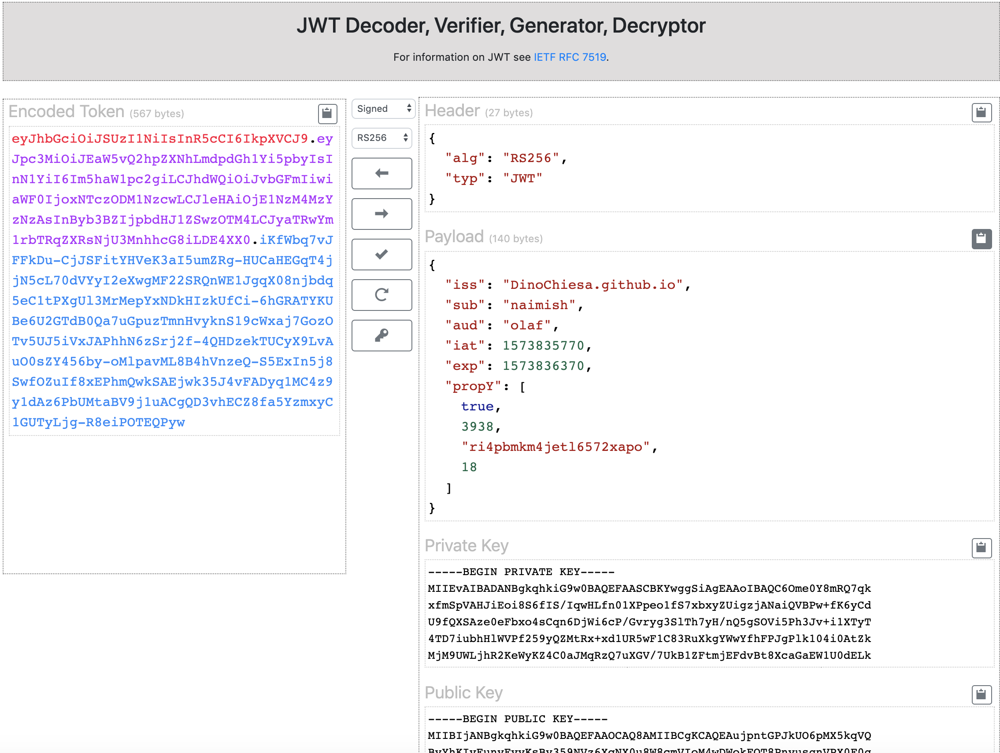

# JWT Web tool

This is the source code for a web tool that can decode JWT, verify signed JWT,
decrypt encrypted JWT, and create signed or encrypted JWT. It has some
limitations!



## License

This code is Copyright (c) 2019 Google LLC, and is released under the Apache
Source License v2.0. For information see the [LICENSE](LICENSE) file.

## Purpose

I built this as a tool that might be helpful to developers learning JWT, or
experimenting with ways to use JWT.  The output of this repo is currently
running [here](https://dinochiesa.github.io/jwt/).

## Disclaimer

This tool is not an official Google product, nor is it part of an official
Google product.

## Limitations

This tool has some limitations:
 - For signed JWT, the tool handles JWT that use ECDSA (ES256, ES384, ES512),
   RSA (RS256, RS384, RS512, PS256, PS384, PS512) or HMAC algorithms (HS256,
   HS384, HS512).

 - For encrypted JWT, it handles JWT that use RSA keys, and RSA algorithms
   (RSA-OAEP, RSA-OAEP-256), as well as the PBES2 algorithms. It does not
   support other alg types for encrypted JWT, such as "dir" or any of the
   key-wrapping algorithms. It supports all types of enc.

 - In either case (signed or encrypted), this tool does not handle crit headers,
   nor will it extract the certificate from an x5c header. Nor will it check
   thumprints of an x5t header.

 - This tool uses EcmaScript v9, and webcrypto, which means it will run only on
   modern, current browsers.

## Design

This is a single-page web app. It has no "backend" supporting it. All JWT
signing and verifying, or encrypting or decrypting, happens within the browser.
Anything a user pastes into the UI never leaves the browser. It just needs a few
static files.

There's a shortcut: if you open the url with <baseurl>?JWT_HERE, it will decode *that* JWT.   It
saves you a step, pasting in your own JWT. If you're paranoid you can also use
the # as a separator. 


It may be nice to fork this and bundle it into an intranet, to
allow developers within a company to experiment with JWT. As far as I'm
concerned there's no security issue with using the [publicly hosted tool](https://dinochiesa.github.io/jwt/).

## Dependencies

The web app depends on
* [jQuery](https://jquery.com/) - for interactivity
* [Bootstrap 4.0](https://getbootstrap.com/) - for UI and styling
* [node-jose](https://github.com/cisco/node-jose) - for JWT
* [CodeMirror](https://codemirror.net/) - for the in-browser editors
* [webcrypto](https://developer.mozilla.org/en-US/docs/Web/API/Web_Crypto_API) - for generating RSA and ECDSA keys


## Build Dependencies

This tool uses [webpack v4](https://webpack.js.org/) for bundling the assets.


## Please send pull requests

This is my first webpack project, so if anyone has some constructive feedback on
my webpack config, how to improve or optimize it, please let me know.  PR's will be
appreciated.

For example, the JS bundle is about 1mb and the css bundle is 400kb.  Is there a
better way to optimize this?


## Developing

If you fork this repo to mess with the code, here's what I advise.

To build a "development" distribution:

```
npm run devbuild
```

During development, I prefer to use the webpack "watch" capability, which
rebuilds as I modify the source code. For that, open a Chrome browser tab to
file:///path/to/dist/index.html .  Then in a terminal,

```
npm run watch
```

The above command will run "forever", and will rebundle when any source file
changes. When you save a file, wait a few seconds for the build, maybe 5
seconds, and then just click the reload button in the browser tab, to see the
updates.


To build a production distribution:

```
npm run build
```

## Bugs

* Today, there is limited support for key-encryption algorithms. Missing are:
  AES based key-wrapping algorithms, direct keys, and Elliptic Curve.

* It is not possible to use an x509v3 certificate for the source of the public key.
